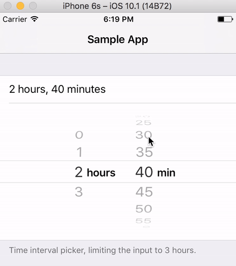

## GSTimeIntervalPicker

A UI component for picking time interval, with the support of setting upper time interval limit.



## Why does this exist?
When building Reminders in [Timelines](http://timelinesapp.io), I stumbled upon the need of letting users pick a time interval between 0 and 3 hours. UIDatePicker in its .CountDownTimer mode supports almost what I needed, but not quite - there is no way how to limit the time interval. With this class, I attempted to fully replicate this UIDatePicker-countDownTimer behavior, while adding the support to limit the interval.

## Features

* Allows limiting the time interval
* Appearance matches exactly that of `UIDatePicker` in countDownTimer mode
* *hours* label changes to *hour* when 1 hour is selected
* informs of changes using callback block `^onTimeIntervalChanged(NSTimeInterval interval)`
* supports setting step (1 min, 5 min, 20 min etc.), same as in UIDatePicker
* when `maxTimeInterval` is bigger than 1 hour, minutes can be scrolled infinitely
* direct subclass of `UIPickerView` - you get the same sizing as with date pickers

## How do I use it?

Since GSTimeIntervalPicker is a subclass of UIPickerView, it carries its intrinsic content size and therefore plays nicely with Autolayout, inputViews, and self-sizing cells. Using it is really simple, it's basically a drop-in replacement of UIDatePicker.

The basic setup in code could look something like this: 

```
GSTimeIntervalPicker *picker = [[GSTimeIntervalPicker alloc] init];
picker.maxTimeInterval = (3600 * 3);    // set the limit
picker.minuteInterval = 5;				// the step. Default is 1 minute
picker.timeInterval = (3600 * 1.5);    	// 1 h 45 minutes
picker.onTimeIntervalChanged = ^(NSTimeInterval newTimeInterval) {
	// Use the value
};
```

Now, here are some notes on common use cases:

### As an inputView

Simply assign the picker to the `inputView` property of your first responder like so:

```
myFirstResponderObject.inputView = picker;
```

Note: If you are using something else than textView / textField, you might need to create a readwrite property for the inputView, because for some strange reason, UIResponder defines it as read-only. For more details, consult this great guide by Apple [Custom Views for Data Input](https://developer.apple.com/library/content/documentation/StringsTextFonts/Conceptual/TextAndWebiPhoneOS/InputViews/InputViews.html)


### As a self-sizing cell
Create a cell and place this picker inside of it, pinning it to all 4 sides. I prefer using Storyboards and prototype cells for that:

1. Make your cell `217` points tall. (pickers are 216 points by default, so 1 extra point is for the cell separator)
2. Drag a `UIPickerView` into your cell, and set its class to `GSTimeIntervalPicker` in the Identity Inspector
3. Pin it to all 4 sides, like so:


To see a complete example of this, try out the sample app attached with this code.


### As just a view in your view controller 

That's pretty much the same as using it in the table view cell, and more details are beyond the scope of this readme.

---

I hope you'll find this helpful :). And - I know, it's *not in Swift*! I might convert it one day. For now, if you need Swift version, take it as an exercise to convert it yourself.

If you have any questions, you can contact me on Twitter <a href="http://twitter.com/luksape target="_blank">@luksape</a>.
